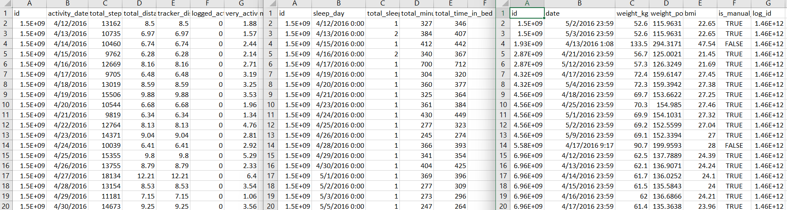
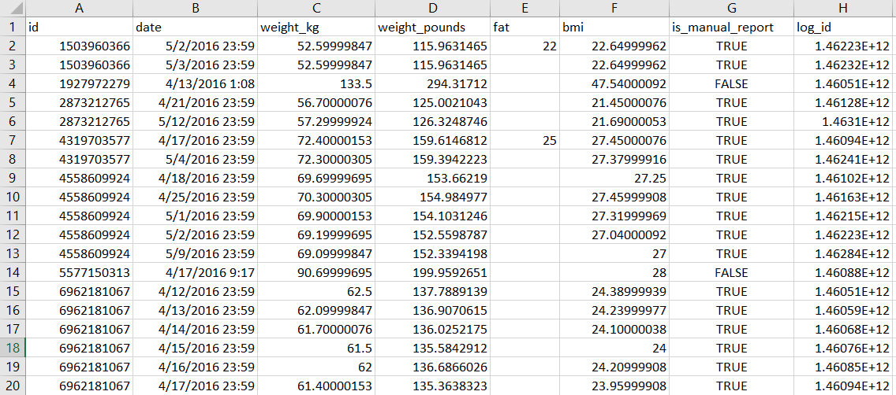
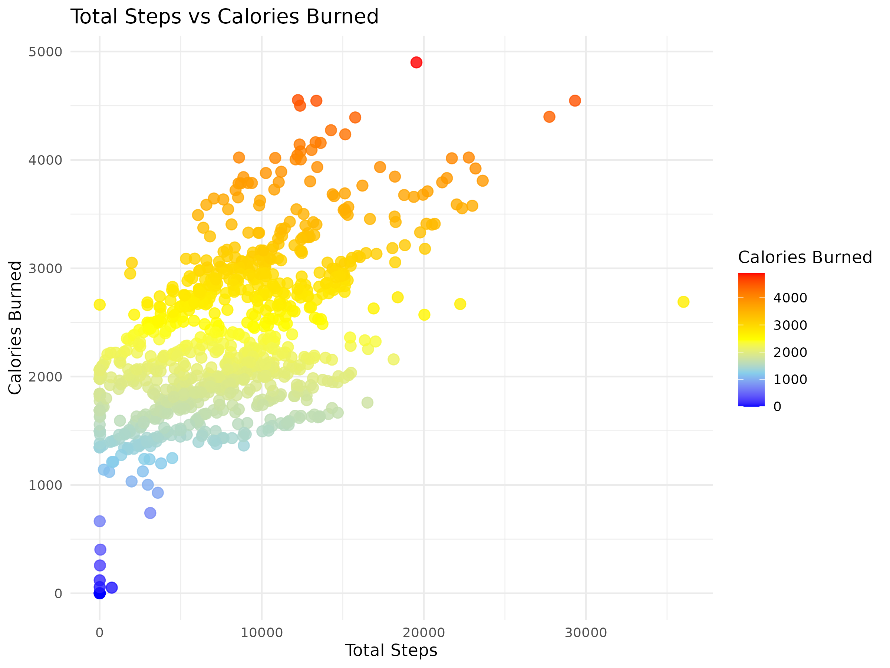
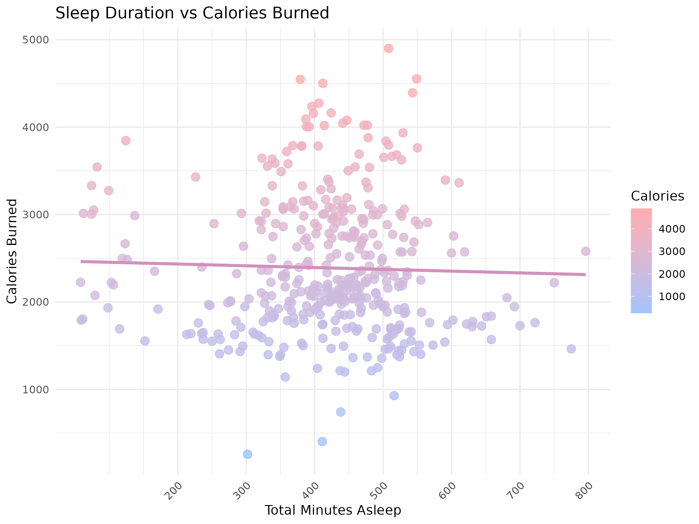
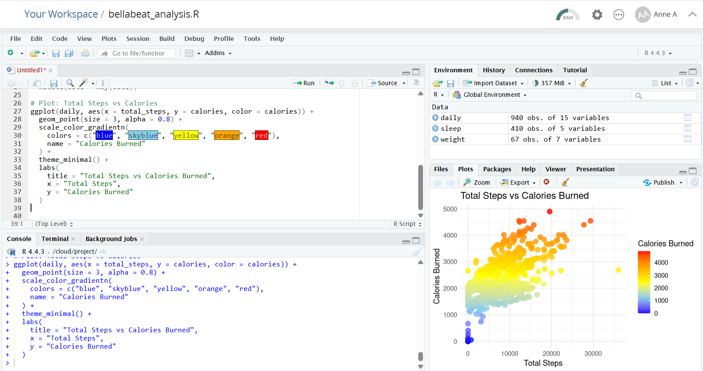
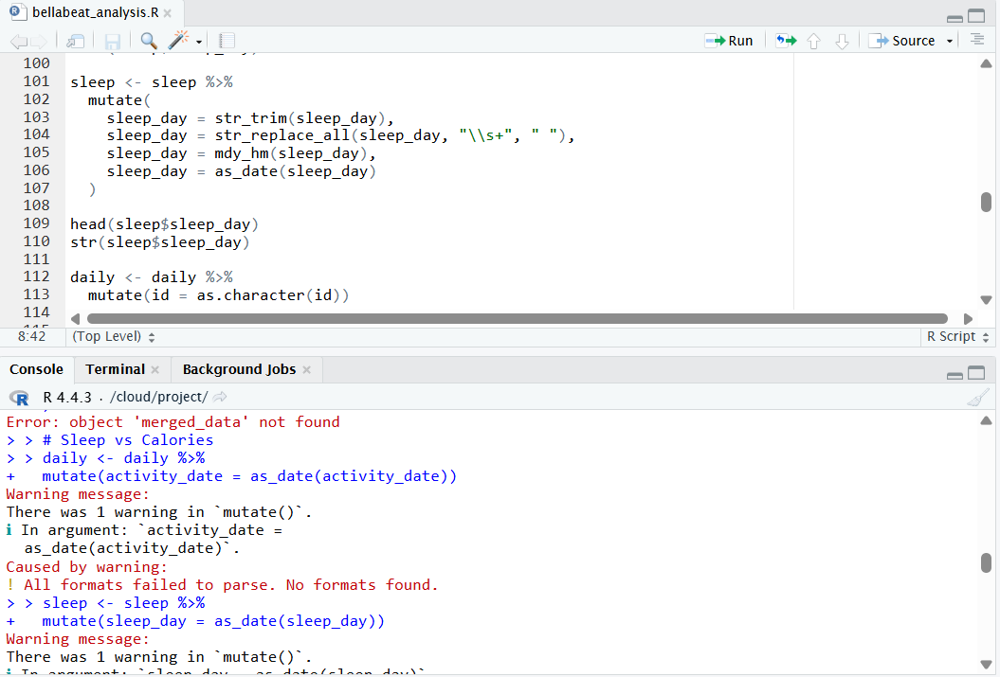

# 📊 Capstone Project: Bellabeat Case Study

📚 **A Project for the Google Data Analytics Professional Certificate**

---

## 📝 INTRODUCTION

**Scenario**:
You are a junior data analyst working on the marketing analyst team at Bellabeat, a high-tech manufacturer of health-focused products for women. Bellabeat is a successful small company, but they have the potential to become a larger player in the global smart device market. Urška Sršen, cofounder and Chief Creative Officer of Bellabeat, believes that analyzing smart device fitness data could help unlock new growth opportunities for the company. You have been asked to focus on one of Bellabeat’s products and analyze smart device data to gain insight into how consumers are using their smart devices. The insights you discover will then help guide marketing strategy for the company. You will present your analysis to the Bellabeat executive team along with your high-level recommendations for Bellabeat’s marketing strategy.

---

## 🧠 ASK

**1. Business Task:**  
Bellabeat is a wellness company that focuses on empowering women through smart health devices. Their stakeholders wants to gain insights from fitness tracker data to inform its marketing strategy. The goal is to better understand user behavior and identify trends that can help grow its user base.

**2. Key Stakeholders:**  
- Urška Sršen (Co-founder & CCO of Bellabeat)  
- Bellabeat Marketing Analytics Team  
- Product Strategy & Innovation Team

**3. Guiding Questions:**  
- What are some trends in smart device usage?  
- How do users engage with fitness and wellness data?  
- How could these trends help Bellabeat grow and market its products?

---

## 📦 PREPARE

**1. Dataset Source:**  
📁 FitBit Fitness Tracker Dataset (2016 – Public Domain)  
🔗 [Kaggle Link](https://www.kaggle.com/datasets/arashnic/fitbit)

**2. Files Used for This Study:**
- `dailyActivity_merged.csv`  
- `sleepDay_merged.csv`  
- `weightLogInfo_merged.csv`

**3. Notes on Data Quality:**  
The dataset includes daily logs from 30 users over 2 months. Though the sample is limited and not collected by Bellabeat, it offers valuable insights into smart device usage behavior.

**4. ROCCC Analysis:**

| Criteria     | Assessment |
|--------------|------------|
| **R**eliable     | ✅ Yes      |
| **O**riginal     | ❌ No (Not Bellabeat’s proprietary data) |
| **C**omprehensive| ⚠️ Limited sample |
| **C**urrent      | ❌ From 2016 |
| **C**ited        | ✅ Public Domain |

---

## 🧹 PROCESS

**Tool Used:** Microsoft Excel

Each dataset was cleaned and standardized before analysis in R:

1. Column names were renamed using `snake_case`
2. Date formats were cleaned and parsed correctly
3. Null values (blanks) and duplicate rows were checked
4. The `fat` column in `weightLogInfo_merged.csv` was removed due to missing data
5. Final cleaned files:
  - `cleaned_daily_activity.csv`
  - `cleaned_sleep_day.csv`
  - `cleaned_weight_log_info.csv`

### 🔍 Visual Glimpse of Cleaning Process

Screenshots of the cleaning process using Excel filters and formatting:

1. All cleaned `.csv` files:

2. Example of file with incomplete data:

---

## 📊 ANALYZE

**Tools Used:** R (tidyverse, lubridate, ggplot2)

Cleaned `.csv` files were analyzed using R to explore the relationships between user activity, calories burned, and sleep behavior. Visualizations were saved using `ggsave()` and stored in the `/visuals` folder.

---

### 🔹 1. Total Steps vs Calories Burned  
📎 **Type:** Heatmap-style Scatter Plot  
📌 **Insight:** A strong positive relationship — more steps taken = more calories burned.

---

### 🔹 2. Average Steps by Day of Week  
📎 **Type:** Bar Chart with Solid Fill  
📌 **Insight:** Users burn more calories on Saturdays and Tuesdays and are less active on Sundays.

---

### 🔹 3. Sleep Duration vs Calories Burned  
📎 **Type:** Scatter Plot with Smooth Trend  
📌 **Insight:** Users with longer sleep durations tend to burn _slightly_ more calories, suggesting rest supports activity levels.

### 💻 R Environment in Action

Screenshots captured during live analysis in R using tidyverse, lubridate and ggplot2:

1. Running R Code for analyzing and visualizing:

2. Renaming, checking and cleaning the data in R:

3. Example of Error encountered in R:

---

## 💡 ACT

Based on the analysis, here are three actionable marketing strategies that Bellabeat could implement:

### 1. 🏃‍♀️ Weekend Warrior & Tuesday Boost Campaigns

From the analysis, it was observed that users tend to be most active on Saturdays and Tuesdays, suggesting a pattern of high activity near the weekend and early in the work week.
Bellabeat could capitalize on this by launching themed campaigns like:
- _“Saturday Stride”_ or _“Weekend Warrior”_ challenges.
- _“Tuesday Boost”_ motivational pushes.
- In-app step goal streaks tied to these peak days.
- Limited-time rewards for consistent activity.

This strategy taps into organic user behavior and boosts motivation when users are naturally more active.

### 2. 😴 Sleep-Based Wellness Nudges

The scatter plot analysis showed a positive relationship between sleep duration and calories burned, implying that better sleep might encourage more physical activity.
Bellabeat can introduce features like:
- Sleep score feedback with personalized daily suggestions.
- Morning nudges that encourage hydration or stretching after good sleep.
- In-app reminders promoting healthy nighttime routines.
.
This positions Bellabeat not just as a tracker but as a wellness coach, making the product more holistic and value-driven.

### 3. 🎨 Interactive Heatmap Visualizations
Users responded well to the heatmap-style visualizations created in this analysis, which use color gradients to highlight performance trends. Bellabeat could implement similar in-app dashboards that show:
- Step count trends over time.
- Calorie burn intensity via color gradients.
- Personalized “heat zones” for progress tracking.
- Gamifying insights through aesthetic, visual storytelling enhances user engagement and can encourage continued app use.

---

## 💬 REFLECTION

This capstone project has allowed me to apply the entire data analysis process. I did the six phases of a data analysis, which are **Ask**, **Prepare**, **Process**, **Analyze**, **Share** and **Act**. I managed to understand and conduct the steps, from cleaning messy raw files in Excel, to exploring behavioral patterns with R, and also in building actionable insights through visual storytelling.

During the analysis phase of this case study, I encountered several unexpected errors, some of which I had never faced before. These moments pushed me to research error messages online, consult R documentation, and explore support communities to find solutions.

Although at times overwhelming, these challenges strengthened my technical confidence and taught me how to troubleshoot independently, which is a crucial skill for any analyst. Most importantly, it reaffirmed my passion for turning messy data into meaningful insights that support data-driven decision-making.

In a nutshell, this project/ case study has reinforced my passion for using data to empower better decision-making, and also to promote health, wellness, and digital innovation.

---

## 📁 Repository Structure

| Folder/File                  | Description                                         |
|-----------------------------|-----------------------------------------------------|
| `README.md`                 | Main project summary and documentation              |
| `bellabeat_analysis.R`      | Completed R script containing all analysis code          |
|                             |                                                     |
| 📂 `data/`                  | Folder containing cleaned datasets                  |
|  - `cleaned_daily_activity.csv`      | Daily user activity data (cleaned)         |
|  - `cleaned_sleep_day.csv`           | Sleep log data (cleaned)                   |
|  - `cleaned_weight_log_info.csv`     | Weight tracking data (cleaned)             |
|                             |                                                     |
| 📂 `visuals/`               | Data visualizations & screenshots from R            |
|  - `steps_vs_calories_heatmap.png`   | Heatmap: Steps vs Calories                 |
|  - `sleep_vs_calories.png`           | Scatter plot: Sleep vs Calories     |
|  - `avg_steps_by_day.png`            | Bar chart: Average Steps by Day of the Week        |
|  - `all_cleaned_files.png`           | Screenshot of cleaned files overview       |
|  - `weightlog_fat_incomplete_data.png`| Missing values in WeightLog visual         |
|  - `analyze_visualize_with_R.png`    | Screenshot: Visualizing in R               |
|  - `data_check_R.png`                | Screenshot: Glimpse() checks in R          |
|  - `error_example_R.png`             | Screenshot: Example of a parsing error in R     |

---

## 👩‍💻 About Me

Hi! I’m Nurul Fatimah Az-Zaharah Mohd Aris, a data-driven energy & tech enthusiast transitioning into data analytics. I’m passionate about using data for sustainable solutions, wellness, and impactful change.

📬 [LinkedIn](https://www.linkedin.com/in/nurul-fatimah-az-zaharah-mohd-aris-79485213a/) • ✉️ [Email Me](mailto:anne.ariss@outlook.com)

---
